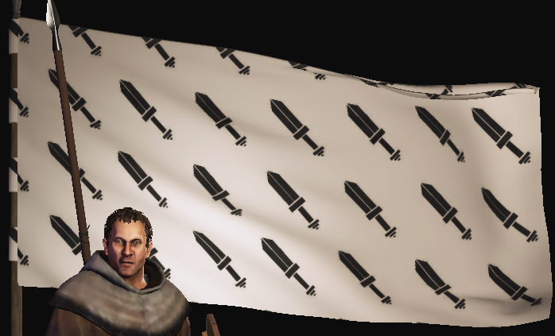

# BannerGenerator
A bunch of utilities to generate banners for Mount &amp; Blade II: Bannerlord



## Setup

- Refernce the nuget package [`Bannerlord.BannerGenerator`](https://www.nuget.org/packages/Bannerlord.BannerGenerator) in your project
- Use the methods named `Utilities.Generate()` to generate a banner code as a string

- To get a banner from an **item list** and a background (similar to https://bannerlord.party/banner/)

```cs
var backgroundParams = new BackgroundGeneratorParams {
	MeshId = BackgroundMesh.Fill,
	Colour1 = Colour.White,
	Colour2 = Colour.White,
};
var itemParams = new List<ItemGeneratorParams>
{
	new ItemGeneratorParams
	{
		MeshId = Mesh.Bird0,
		Colour1 = Colour.Black,
		Colour2 = Colour.Black,
		Size = Utilities.SUGGESTED_ITEM_DIMENSIONS,
		AlignX = AlignX.Centre,
		AlignY = AlignY.Centre
	}
};
Console.WriteLine("Item");
Console.WriteLine(Utilities.Generate(backgroundParams, itemParams, null, null));
```

- To get a banner for a **pattern** and a background [example shown above](images/fill.png)

```cs
var patternParams = new List<PatternGeneratorParams>
{
	new PatternGeneratorParams
	{
		MeshId = Mesh.Sword0,
		Type = PatternType.Fill,
		Margin = 200,
		Colour1 = Colour.Black,
		Colour2 = Colour.Black,
		Size = new Vector2(200),
		Rotation = 45,
	}
};
Console.WriteLine("Pattern");
Console.WriteLine(Utilities.Generate(backgroundParams, null, patternParams, null));
```

- To get a banner for a **circular pattern** and a background [example](images/circle.png)

```cs
var params = new List<CircleGeneratorParams>
{
	new CircleGeneratorParams
	{
		MeshId = Mesh.Sword0,
		Amount = 25,
		Radius = 200,
		Colour1 = Colour.Black,
		Colour2 = Colour.Black,
		Size = new Vector2(100),
		AutomaticRotation = true,
	}
};
Console.WriteLine("Circle");
Console.WriteLine(Utilities.Generate(backgroundParams, null, null, params));
```

- You can also combine any number of items/patterns/circles [example](images/combine.png)